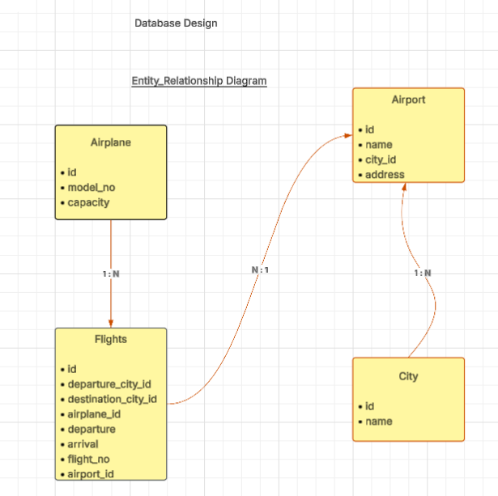

# Welcome to Flights Service ✈️

## Project Setup
- Clone the project to your local system.
- Run the following command in the root directory of the project to install dependencies:  
```
  npm install
```
- Create a `.env` file in the root directory and add the following environment variable:
```
 PORT = 3000
```
- Inside the `src/config` folder, create a new file `config.json` and add the following configuration:

```
{
  "development": {
    "username": <YOUR_DB_LOGIN>,
    "password": <YOUR_DB_PASSWORD>,
    "database": "flights_search_DB_DEV",
    "host": "127.0.0.1",
    "dialect": "mysql"
  },
}
```
- Once you've added your DB config, go to the `src` folder from your terminal and run the following

```
npx sequelize db:create
npx sequelize db:migrate
```

## Database Design
**Tables:**
  - Airplane
  - Flight
  - Airport
  - City

**Relationships:**
  - A flight belongs to an airplane, but one airplane can be used in multiple flights.
  - A city has many airports, but one airport belongs to a single city.
  - One airport can have many flights, but a flight belongs to one airport.

<h2>✈️ DB Design Diagram</h2>


## Tables schema
### City -> id, name, created_at, updated_at
### Airport -> id, name , address, city_id, created_at, updated_at
  **Relationships**
    - City has many airports and Airport belongs to a city (one to many)
